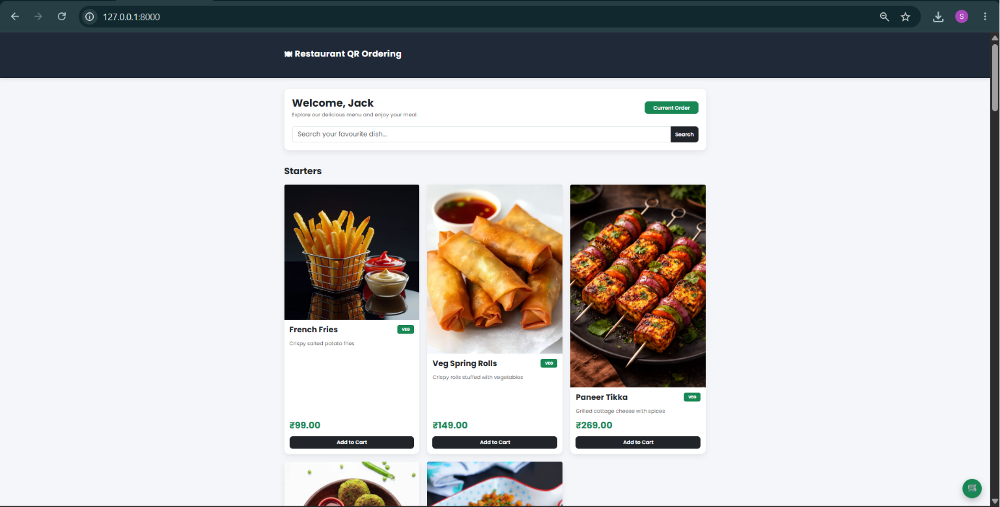
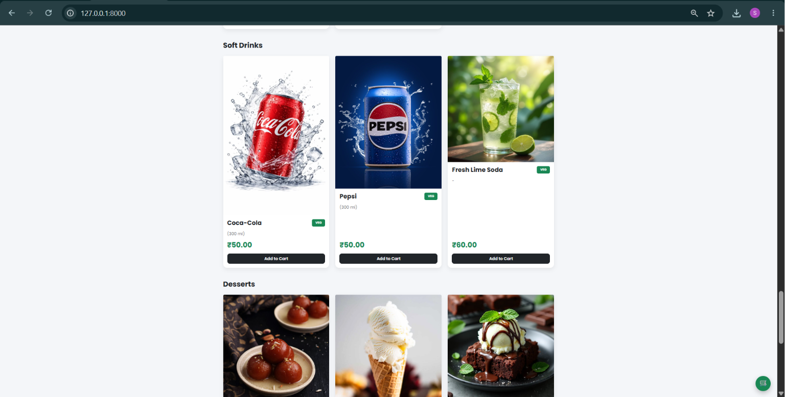
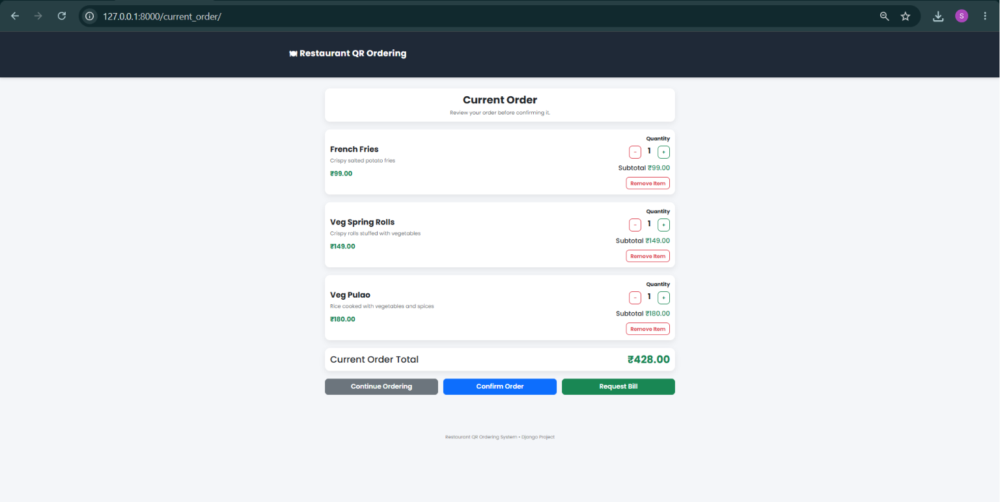
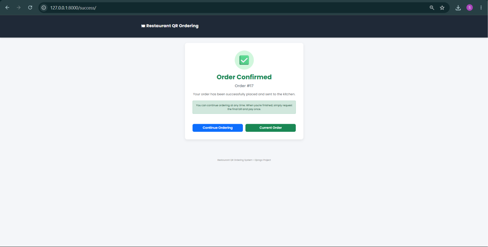
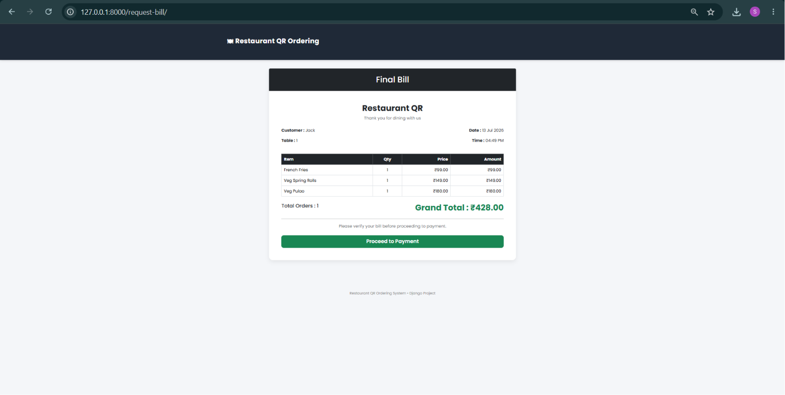
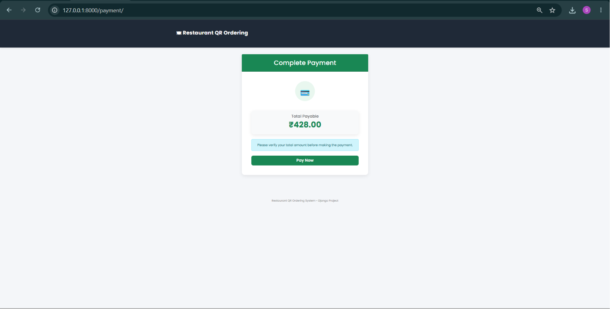
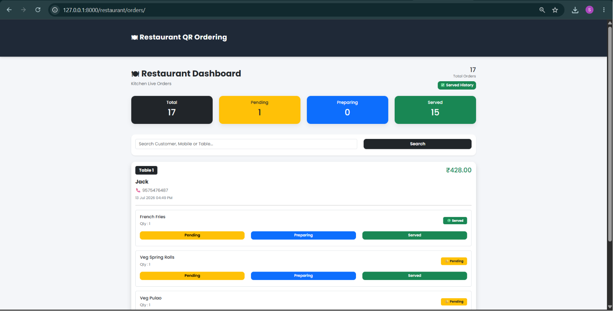
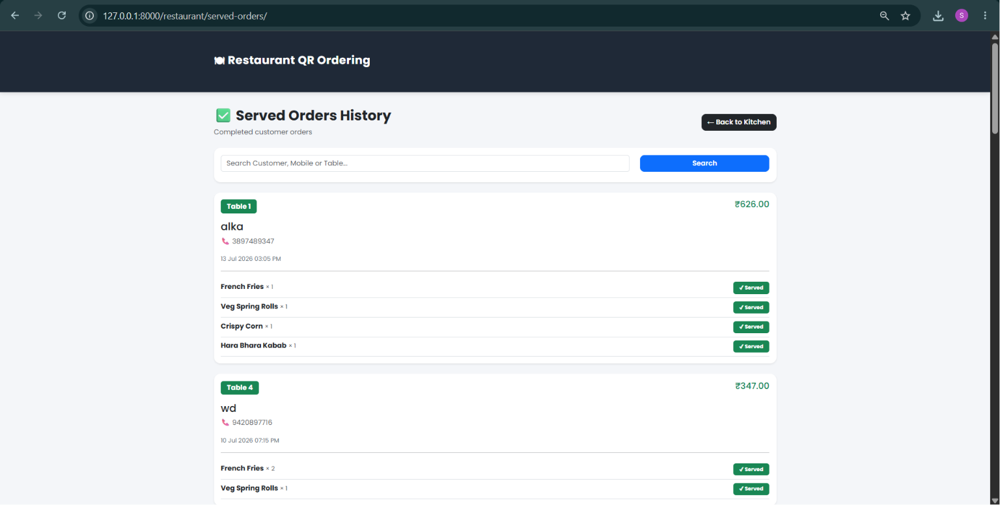
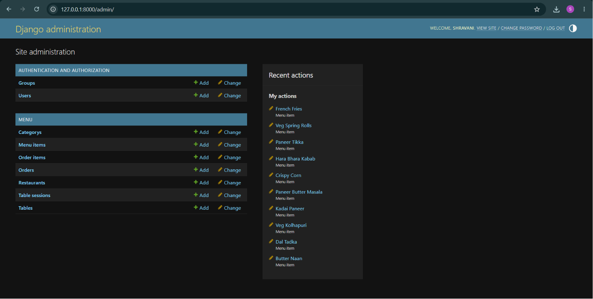

# 🍽️ Restaurant QR Ordering System

A modern QR-based digital restaurant ordering platform built with Django that enables customers to scan table QR codes, browse menus, place orders, track order status, and request bills in real time.

---

## 📌 Features

### 👨‍🍳 Customer Side

- Scan table-specific QR code
- Browse restaurant menu
- Add items to cart
- Place orders
- Track current order status
- View order history
- Request bill
- View total bill amount
- Multiple customers at the same table can order together

---

### 🍽️ Restaurant Dashboard

- View incoming orders
- Mark individual dishes as Served
- Mark complete orders as Completed
- View served order history
- Manage order workflow efficiently

---

### 🔐 Admin Panel

- Add/Edit/Delete Menu Items
- Upload food images
- Manage restaurant tables
- View customer orders
- Manage restaurant data using Django Admin

---

## 🛠️ Tech Stack

- Python
- Django
- HTML
- CSS
- JavaScript
- Bootstrap
- SQLite
- QR Code Generation

---

## 📂 Project Structure

```
restaurant_qr/
│
├── menu/
├── restaurant_qr/
├── manage.py
├── requirements.txt
└── README.md
```

---

## 🚀 Installation

Clone the repository

```bash
git clone https://github.com/shravani-malagi/restaurant-qr-ordering-system.git
```

Move into the project

```bash
cd restaurant-qr-ordering-system
```

Install dependencies

```bash
pip install -r requirements.txt
```

Run migrations

```bash
python manage.py migrate
```

Start the server

```bash
python manage.py runserver
```

Open

```
http://127.0.0.1:8000/
```

---

## 📸 Screenshots

## 📸 Screenshots

### 🏠 Welcome Page


### 🍽️ Menu Page


### 🛒 Current Order


### ✅ Order Confirmation


### 📄 Final Bill


### 💳 Payment


### 🍳 Restaurant Dashboard


### 📜 Served Orders History


### ⚙️ Django Admin


---

## 🔮 Future Improvements

- Online Payment Integration
- Kitchen Display System
- Live Notifications
- Waiter Management
- Inventory Management
- Customer Reviews
- Sales Analytics Dashboard

---

## 👩‍💻 Developed By

**Shravani Malagi**

GitHub:
https://github.com/shravani-malagi

---

⭐ If you like this project, don't forget to star the repository.
